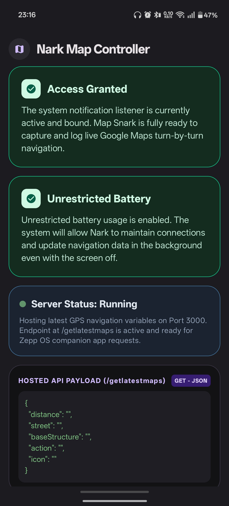
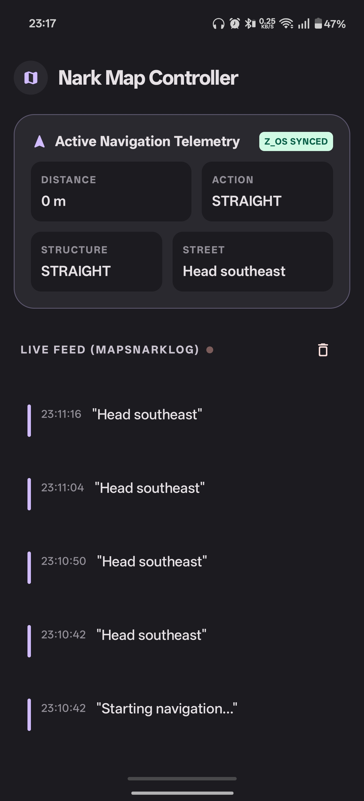
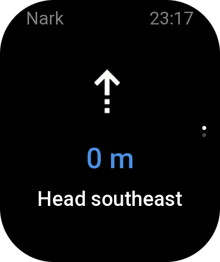
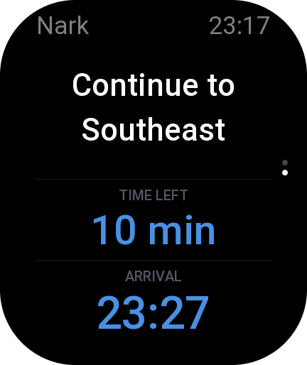
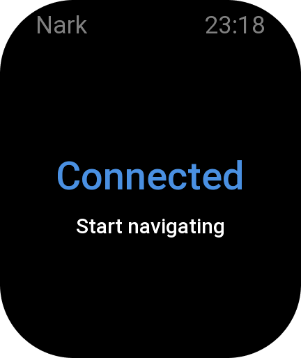

# Nark Navigation

Nark Navigation is an open-source navigation companion for ZeppOS smartwatches.

It consists of two components:

- 📱 Android Companion App
- ⌚ ZeppOS Smartwatch App

The Android app listens for Google Maps navigation notifications, extracts turn-by-turn navigation data, and securely forwards it to the connected smartwatch over Bluetooth.

The goal is to let users navigate comfortably from their wrist without constantly checking their phone.

> ⚠️ **Status:** Active Development
>
> This project is functional but still under active development. You may encounter bugs, glitches, unfinished features, or unexpected behavior.

---

# Features

- 📍 Google Maps turn-by-turn navigation forwarding
- ⌚ Real-time navigation on ZeppOS smartwatches
- 🔔 Notification Listener based implementation
- 📡 Local Bluetooth communication between phone and watch
- 🔒 Privacy-first design
- ⚡ Lightweight background service
- 🚫 No cloud servers
- 🚫 No analytics
- 🚫 No tracking

---

# Screenshots

## 📱 Android Companion App

The Android companion app runs in the background, listens for Google Maps navigation notifications, and transmits navigation instructions to the smartwatch.

<p align="center">
  
  &nbsp;&nbsp;&nbsp;
  
</p>

---

## ⌚ ZeppOS Smartwatch App

The smartwatch app displays clear, glanceable navigation instructions while you're walking, cycling, or driving.

<p align="center">
  
  &nbsp;&nbsp;
  
  &nbsp;&nbsp;
  
</p>

---

# How It Works

1. Start navigation in Google Maps.
2. Grant Notification Access to Nark Navigation.
3. Connect your smartwatch.
4. The Android app listens for Google Maps navigation notifications.
5. Navigation instructions are processed locally.
6. The instructions are transmitted to the smartwatch over Bluetooth.
7. The smartwatch displays navigation updates in real time.

---

# Download

The latest release, including both the Android companion app (`.apk`) and the ZeppOS smartwatch app (`.zab`), can be downloaded from the Releases page.

➡️ **https://github.com/Barath702/Nark/releases/tag/v1.0**

---

# Compatibility

## Tested Devices

Currently, the project has only been tested with:

- ⌚ Amazfit Bip Max

Other ZeppOS smartwatches may work, but compatibility has not yet been verified.

Community testing on additional devices is highly appreciated.

---

# Before Using

For reliable operation:

1. Grant **Notification Access**.
2. Set **Battery Usage** for Nark Navigation to **Unrestricted**.
3. Allow the app to run in the background.

> Android battery optimization may stop the background service, preventing navigation updates from reaching the watch.

---

# Permissions

The Android app requires:

- Notification Access
- Foreground Service
- Network Access
- Wake Lock

These permissions are used solely to provide reliable navigation forwarding.

---

# Privacy

Nark Navigation is designed with privacy as a priority.

- No account required
- No advertisements
- No analytics
- No cloud synchronization
- No tracking
- No collection of personal navigation history

All processing occurs locally on your own devices.

---

# Known Issues

This project is still under active development.

You may encounter:

- Minor bugs
- UI glitches
- Temporary connection issues
- Missed navigation updates
- Unexpected behavior on unsupported devices

If you discover an issue, please open a GitHub Issue with details so it can be reproduced and fixed.

---

# Repository Structure

```
Nark-Navigation/
│
├── android/                 Android companion app
├── watch/                   ZeppOS smartwatch app
├── screenshots/
│   ├── phone-1.png
│   ├── phone-2.png
│   ├── watch-1.png
│   ├── watch-2.png
│   ├── watch-3.png
│   └── watch-menu.png
│
├── README.md
├── LICENSE
└── .gitignore
```

---

# Building

## Android Companion App

1. Open the `android` folder in Android Studio.
2. Sync Gradle.
3. Build and install the application.

## ZeppOS Smartwatch App

1. Open the `watch` folder using the ZeppOS development tools.
2. Build the project.
3. Install it on a compatible ZeppOS smartwatch.

---

# Roadmap

- ETA display
- Remaining distance display (when available)
- Better smartwatch UI
- Improved connection stability
- Battery optimizations
- Support for more ZeppOS watches
- Additional customization options

---

# Contributing

Contributions are welcome.

Feel free to:

- Report bugs
- Suggest features
- Improve documentation
- Submit pull requests

---

# Disclaimer

Nark Navigation is an independent open-source project and is **not affiliated with, endorsed by, or sponsored by Google, Google Maps, Amazfit, or Zepp Health**.

Google Maps is a trademark of Google LLC.

---

# License

This project is licensed under the MIT License.
